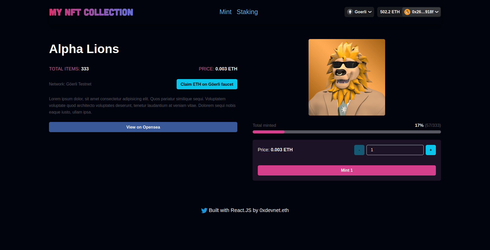
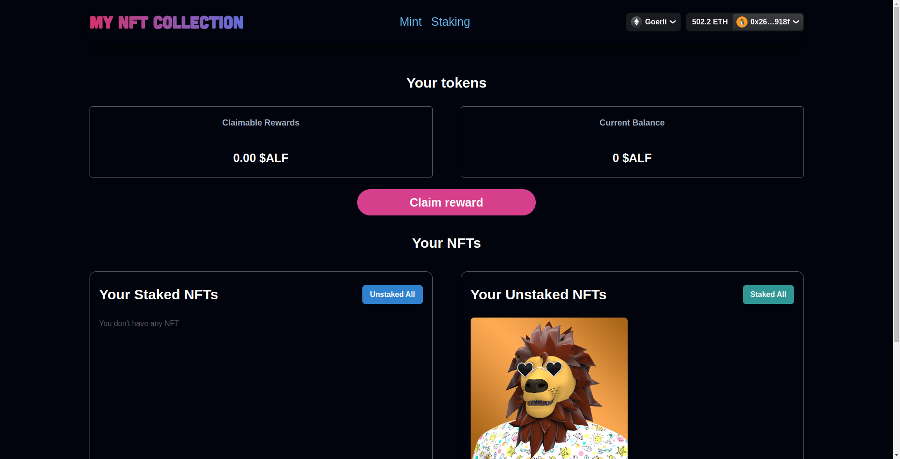

# AlphaLions NFT Mint & Staking

[](https://twitter.com/0xdevnet_eth)

[](https://twitter.com/0xdevnet_eth)

### Smart Contract, mint and staking page of Alpha Lions NFT v2 NFT collection
### The Smart Contract has been deployed on the network: <b>Göerli Testnet</b>
#### The app is mobile responsive

## Tasks
 - [x] Mint an NFT (ERC721A)
 - [x] Stake an NFT
 - [x] Unstake an NFT
 - [x] Claim the rewards (ERC20 token)
 - [x] Connect with several different wallets
 - [x] See their NFTs on Opensea
 - [x] See your Tokens on Metamask
 

## [LIVE Link](https://alpha-lions-nft-mint-staking.vercel.app/)
## [View on Opensea](https://testnets.opensea.io/collection/alpha-lions-nft-v2)
## [Claim ETH on Göerli faucet](https://goerli-faucet.pk910.de/)

## Contract Address
 - Nft-ERC721A Contract Address: <b>0xa9ABD93032E9f2e3E0177bf52aee4c1CC69B8Cec<b/>
 - Token-ERC20 Contract Address: <b>0x2f0AE90811f0367b388c3196dE9AcfB5f46ba9c5<b/>
 - Nft-Staking Contract Address: <b>0x234466b0B29062228cA12510Cd1b17c0F1a414Ab<b/>

## Technologies utilisés 
 - Solidity
 - Hardhat
 - Ethers JS
 - React
 - Chakra UI

### Installation

1. clone github repo
   ```sh
   https://github.com/iprotoni/AlphaLions-NFT-Mint-Staking.git
   ```
2. Install dependencies
   ```sh
   npm install
   ```
3. Run the app
   ```sh
   npm start
   ```


# Sample Hardhat Project

This project demonstrates a basic Hardhat use case. It comes with a sample contract, a test for that contract, and a script that deploys that contract.

Try running some of the following tasks:

```shell
npx hardhat help
npx hardhat test
REPORT_GAS=true npx hardhat test
npx hardhat node
npx hardhat run scripts/deploy.js
```

## Contact

0xdevnet.eth - [twitter](https://twitter.com/0xdevnet_eth) 

Project Link: [github](https://github.com/iprotoni/AlphaLions-NFT-Mint-Staking.git)
